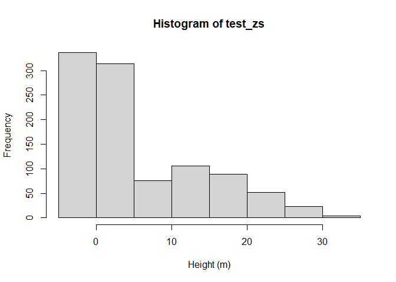

# STRIDE: Simulating Travel Rates In Diverse Environments
Mickey Campbell
2024-06-26

- [Introduction](#introduction)
- [Installing `stride`](#installing-stride)
- [Loading necessary libraries](#loading-necessary-libraries)
- [Downloading lidar data](#downloading-lidar-data)
- [Generating a DTM](#generating-a-dtm)
- [Generating a ground surface roughness
  raster](#generating-a-ground-surface-roughness-raster)
- [Generating a vegetation density
  raster](#generating-a-vegetation-density-raster)
- [Checking raster alignment](#checking-raster-alignment)
- [Get barrier rasters](#get-barrier-rasters)
- [Build transition matrix](#build-transition-matrix)
- [Map least-cost paths](#map-least-cost-paths)

## Introduction

`stride` is an R library for mapping least-cost paths and estimating
travel time across a diverse range of landscape conditions. It employs
the Simulating Travel Rates In Diverse Environments (STRIDE) model,
which was recently developed as part of a study by Campbell et al. (*in
review*):

Campbell, Michael J., Cutler, Sierra L., Dennison, Philip E., (*in
review*). A singular, broadly-applicable model for estimating on- and
off-path walking travel rates using airborne lidar data.

The study employed the use of three different field experiments, where
three different groups of study subjects walked a series of 100 m-long
linear transects through wide-ranging environmental conditions, from
flat urban streets to densely vegetated, steep forests with unimproved
ground surfaces. The travel rates from these experiments were compared
to lidar-derived estimates of terrain slope, low-lying vegetation
density, and ground surface roughness within each of the transects using
non-linear least-squares regression. The resulting model demonstrated an
impressive ability to accurately predict travel rates across
wide-ranging landscape conditions, and yielded logically consistent
least-cost paths when applied in a spatial context.

To enable broad use and consistent implementation of STRIDE for travel
time estimation and least-cost path mapping, we developed `stride`. This
open-source R library allows users to apply STRIDE in a simple and
user-friendly way. All the user needs is a lidar point cloud dataset and
a set of some origin and destination points, and `stride` can map the
least-cost paths between them and calculate an accurate travel time
estimate.

## Installing `stride`

The first step in the STRIDE modeling workflow is to install the
`stride` R package. At present, `stride` is not available on CRAN, so
you will need to install from Github. One way to do this is shown below:

``` r
# install using devtools
devtools::install_github("https://github.com/mickeycampbell/stride")
```

## Loading necessary libraries

In addition to `stride`, we will employ the use of several other useful
R libraries to ensure successful execution of the STRIDE modeling
workflow. If you do not have these libraries installed already, you will
need to do so prior to loading them. Since they are all available on
CRAN, you can simply use `install.packages()`.

``` r
library(stride)
library(lidR)
library(terra)
```

## Downloading lidar data

To test the STRIDE modeling workflow, you will need an airborne lidar
dataset to work with. There are many potential sources of free airborne
lidar data in the US. For the sake of this example, we will use data
from the [United States Geological Survey (USGS) 3D Elevation Program
(3DEP)](https://www.usgs.gov/3d-elevation-program). One approach for
exploring 3DEP data availability and downloading is through [The
National Map](https://apps.nationalmap.gov/downloader/#/). To see where
lidar data are available, you can check the box next to *Elevation
Source Data (3DEP) - Lidar, IfSAR*. Under *Subcategories*, you can check
the box next to *Lidar Point Cloud (LCP)*. By clicking *Show*, a layer
will be added to the map interface displaying where lidar data are
available for download, colored by [Quality
Level](https://www.usgs.gov/3d-elevation-program/topographic-data-quality-levels-qls).

To download data within an area of interest, you have several options,
including drawing an extent (bounding box), polygon, or point, entering
in extent coordinates manually, or uploading a shapefile or KML. In this
example, we will download four adjacent tiles of lidar data in a
mountainous, forested area near Brighton, UT. 3DEP lidar data are
typically delivered in 1x 1km tiles in LAZ format – a compressed point
cloud data type. So, the example study area will be approximately 2x2 km
in size.

## Generating a DTM

Once you have your lidar data downloaded, the first major step in the
STRIDE workflow is generate a digital terrain model (DTM). To do this,
you will need to use the `lidR` library. `lidR` is an awesome R library
that incorporates a vast array of lidar processing, analysis, and
visualization functions. One of the great strengths of `lidR` is its
ability to process data in parallel. Because lidar data are so massive,
data are almost always tiled into chunks. `lidR`’s `LAScatalog` object
type allows you to read and process tiled lidar data in parallel, using
as many cores as your computer has (or as many as your RAM will alow).
Since we have four tiles of lidar data, we can process those tiles in
parallel by reading the data in as a `LAScatalog` using
`readLAScatalog()`. If, instead, you preferred to read in a single tile
of data, you could use `readLAS()`.

Once the data are read in, we will use `gen_dtm()` to generate DTMs at
two different spatial resolutions:

1.  **1 m resolution**: This DTM will be used for generating a ground
    surface roughness raster dataset, which requires modeling the
    terrain at a high spatial resolution.
2.  **10 m resolution**: This DTM will be used as the basis of
    calculating directional slope, which is one of the movement costs
    that are factored into STRIDE.

``` r
# suppress progress bars
options(lidR.progress = F)

# read in the lidar data as a lascatalog
ctg <- readLAScatalog("C:/temp/stride/lidar_data/raw",
                      filter = "-drop_withheld -drop_class 7 18")
ctg
```

    class       : LAScatalog (v1.4 format 6)
    extent      : 450000, 452000, 4493000, 4495000 (xmin, xmax, ymin, ymax)
    coord. ref. : NAD83(2011) / UTM zone 12N + NAVD88 height - Geoid12B (metre) 
    area        : 4 km²
    points      : 82.78 million points
    density     : 20.7 points/m²
    density     : 13 pulses/m²
    num. files  : 4 

``` r
plot(ctg)
```


As you can see, we filtered out points classified as being “withheld” or
belonging to one of the two “noise” classes (7 and 18) – this aims to
remove bad data from the analysis. By calling `ctg` after reading the
data in, we can see some basic information about the four tiles of lidar
data in this example. By calling `plot(ctg)`, we can see the spatial
extents of the four tiles.

Next, we will generate our DTMs.

``` r
# generate 1m DTM
dtm_1m <- gen_dtm(
  las = ctg,
  res = 1,
  ncores = 4L,
  out_file = "C:/temp/stride/lidar_data/dtm_1m.tif",
  overwrite = T
)
```

    Chunk 1 of 4 (25%): state ✓
    Chunk 2 of 4 (50%): state ✓
    Chunk 3 of 4 (75%): state ✓
    Chunk 4 of 4 (100%): state ✓

``` r
dtm_1m
```

    class       : SpatRaster 
    dimensions  : 2000, 2000, 1  (nrow, ncol, nlyr)
    resolution  : 1, 1  (x, y)
    extent      : 450000, 452000, 4493000, 4495000  (xmin, xmax, ymin, ymax)
    coord. ref. : NAD83(2011) / UTM zone 12N (EPSG:6341) 
    source(s)   : memory
    name        : elevation 
    min value   :  2654.893 
    max value   :  3019.388 

``` r
# generate 10m DTM
dtm_10m <- gen_dtm(
  las = ctg,
  res = 10,
  ncores = 4L,
  out_file = "C:/temp/stride/lidar_data/dtm_10m.tif",
  overwrite = T
)
```


    Chunk 1 of 4 (25%): state ✓
    Chunk 2 of 4 (50%): state ✓
    Chunk 3 of 4 (75%): state ✓
    Chunk 4 of 4 (100%): state ✓

``` r
dtm_10m
```

    class       : SpatRaster 
    dimensions  : 200, 200, 1  (nrow, ncol, nlyr)
    resolution  : 10, 10  (x, y)
    extent      : 450000, 452000, 4493000, 4495000  (xmin, xmax, ymin, ymax)
    coord. ref. : NAD83(2011) / UTM zone 12N (EPSG:6341) 
    source(s)   : memory
    name        : elevation 
    min value   :  2655.062 
    max value   :  3018.445 

``` r
# plot out the 10m DTM
plot(dtm_10m)
```


## Generating a ground surface roughness raster

One of the three cost surfaces that STRIDE relies on to estimate travel
impedance/conductance and enable the mapping of least-cost paths and
accurate estimation of travel times is the roughness of the ground
surface. In the context of STRIDE, roughness is calculated as the mean
of absolute differences between a fine-scale (1 m) DTM and a “smoothed”
version of that DTM, where the smoothing is the result of a circular
mean focal filter. By default, the filter has a radius of 2 m. To
generate this raster, we will use the `gen_rgh()` function.

``` r
# generate a ground surface roughness raster
rgh <- gen_rgh(
  dtm = dtm_1m,
  radius = 2,
  res = 10,
  out_file = "C:/temp/stride/lidar_data/rgh.tif",
  overwrite = T
)
rgh
```

    class       : SpatRaster 
    dimensions  : 200, 200, 1  (nrow, ncol, nlyr)
    resolution  : 10, 10  (x, y)
    extent      : 450000, 452000, 4493000, 4495000  (xmin, xmax, ymin, ymax)
    coord. ref. : NAD83(2011) / UTM zone 12N (EPSG:6341) 
    source      : rgh.tif 
    name        :    roughness 
    min value   : 8.153846e-05 
    max value   : 8.766508e-01 

``` r
# plot it out
plot(rgh)
```


## Generating a vegetation density raster

Another of the three cost surfaces that STRIDE relies on is the density
of vegetation within the range of human height. In Campbell et al. (*in
review*), the height range that was most highly correlated with travel
impedance was 0.85 - 1.20 m. For an average individual 1.70 m tall, this
is approximately waist to chest height – vegetation in this range is
difficult to avoid, and thus a high density of it can slow you down
considerably. Lidar data are excellent at quantifying and mapping
vegetation structure. Because they are measured using narrow laser
pulses that can exploit small gaps in a forest canopy, even in the
presence of tall vegetation, the density of vegetation near the ground
surface can be readily quantified. To capture vegetation density, we
rely on a lidar poin cloud-derived metric referred to as the
**normalized relative density (NRD)**:

$$NRD=\frac{\sum_{i}^{j}n}{\sum_{0}^{j}n}$$

where $\sum_{i}^{j}n$ is the number ($n$) of lidar points between
heights $i$ and $j$ and $\sum_{0}^{j}n$ is the number ($n$) of lidar
points between 0 m (the ground level) and $j$. It is a relative measure
of point density that accounts for canopy occlusion that measures the
proportion of energy intercepted by the vegetation within a height range
of interest prior to reaching the ground.

To calculate NRD, however, requires that lidar points are **normalized
to the ground surface**. By default, of course, lidar data *z* values
are measured in elevation above mean sea level. Accordingly, we need to
convert elevations to heights above the ground. This can be done using
the `norm_hgt()` function.

``` r
# normalize lidar point heights
las_hgt <- norm_hgt(
  las = ctg,
  ncores = 4L,
  out_path = "C:/temp/stride/lidar_data/hgt"
)
```


    Chunk 2 of 4 (25%): state ✓
    Chunk 1 of 4 (50%): state ✓
    Chunk 3 of 4 (75%): state ✓
    Chunk 4 of 4 (100%): state ✓

``` r
las_hgt
```

    class       : LAScatalog (v1.4 format 6)
    extent      : 450000, 452000, 4493000, 4495000 (xmin, xmax, ymin, ymax)
    coord. ref. : NAD83(2011) / UTM zone 12N + NAVD88 height - Geoid12B (metre) 
    area        : 4 km²
    points      : 82.75 million points
    density     : 20.7 points/m²
    density     : 13 pulses/m²
    num. files  : 4 

To make sure this worked, we can take a look at a random sample of *z*
values from one of our height-normalized point clouds:

``` r
# read in one of the height-normalized lidar tiles
laz_files <- list.files("C:/temp/stride/lidar_data/hgt", full.names = T)
test_file <- laz_files[1]
test_las <- readLAS(test_file)
test_zs <- sample(test_las$Z, 1000)
hist(x = test_zs, xlab = "Height (m)", ylab = "Frequency")
```


Looks about right! It’s not uncommon to have some slightly negative
values – height normalization is an imperfect process. This will not
affect the analysis in any significant way.

With our height-normalized data, we can now calculate NRD. To do this,
we can use the `gen_dns()` function. We will use the default values from
Campbell et al. (*in review*) to capture the optimal height range from
that study (0.85 - 1.20 m) and recommend that you do the same.

``` r
# generate a vegetation density raster
dns <- gen_dns(
  las_hgt = las_hgt,
  hgt_1 = 0.85,
  hgt_2 = 1.20,
  res = 10,
  ncores = 4L,
  out_file = "C:/temp/stride/lidar_data/dns.tif",
  overwrite = T
)
```


    Chunk 1 of 4 (25%): state ✓
    Chunk 2 of 4 (50%): state ✓
    Chunk 3 of 4 (75%): state ✓
    Chunk 4 of 4 (100%): state ✓

``` r
dns
```

    class       : SpatRaster 
    dimensions  : 200, 200, 1  (nrow, ncol, nlyr)
    resolution  : 10, 10  (x, y)
    extent      : 450000, 452000, 4493000, 4495000  (xmin, xmax, ymin, ymax)
    coord. ref. : NAD83(2011) / UTM zone 12N (EPSG:6341) 
    source(s)   : memory
    name        : density 
    min value   :       0 
    max value   :       1 

``` r
# plot it out
plot(dns)
```


## Checking raster alignment

An important step in the STRIDE modeling workflow is ensuring that all
of your cost rasters are spatially congruent. That is, they share the
same coordinate reference system (CRS), spatial resolution, extent, and
origin. This can be done easily with `algn_rasts()`. This function first
checks to see if these spatial characteristics are congruent.
Optionally, it can also force them into congruence. This option should
be employed cautiously, as the user has little control over how that
congruence is forced. It may be beneficial to manually force congruence
using tools in the `terra` library. Provided that the entire workflow
has taken place as outlined above, the three inputs should be spatially
congruent and not require forcing. Only if rasters were generated
outside of this package might this become necessary.

``` r
# check raster alignment
r <- algn_rasts(
  dtm = dtm_10m,
  dns = dns,
  rgh = rgh,
  force = T
)
```

    DTM
      - CRS: NAD83(2011) / UTM zone 12N
      - Extent:
        - XMin: 450000
        - XMax: 452000
        - YMin: 4493000
        - YMax: 4495000
      - NRow: 200
      - NCol: 200
      - Origin: 00

    Density
      - CRS: NAD83(2011) / UTM zone 12N
      - Extent:
        - XMin: 450000
        - XMax: 452000
        - YMin: 4493000
        - YMax: 4495000
      - NRow: 200
      - NCol: 200
      - Origin: 00

    Roughness
      - CRS: NAD83(2011) / UTM zone 12N
      - Extent:
        - XMin: 450000
        - XMax: 452000
        - YMin: 4493000
        - YMax: 4495000
      - NRow: 200
      - NCol: 200
      - Origin: 00

    CRS: MATCH

    Extent: MATCH

    NRow: MATCH

    NCol: MATCH

    Origin: MATCH

## Get barrier rasters

In addition to the three cost rasters (DTM, vegetation density, and
ground surface roughness), STRIDE was formulated with some barriers in
mind, to capture landscape features that inhibit pedestrian movement.
The function `get_bars()` creates rasterized representation of two types
of barriers:

1.  **Cliffs**: Areas with terrain slopes greater than 45 degrees.
2.  **Waterbodies**: Ponds and lakes that one cannot walk across.

Cliffs are generated directly from the 10 m DTM. Waterbodies can come
from one of two sources: (1) user-supplied; or (2) automatically
downloaded from the [USGS National Hydrography Dataset (NHD)
Plus](https://www.usgs.gov/national-hydrography/nhdplus-high-resolution).
The NHD is only available in the US, so users outside of the US will
need to supply their own hydrography data. Users within the US can also
supply their own hydrography data, but if they do not, waterbodies will
be downloaded from the USGS NHD. Of course, this means an internet
connection is required for successful use.

The barrier rasters will automatically be aligned with the cost rasters,
so no additional congruency checks are needed.

``` r
# get barrier raster data
bars <- get_bars(
  dtm = dtm_10m,
  out_file_clf = "C:/temp/stride/lidar_data/clf.tif",
  out_file_wtr = "C:/temp/stride/lidar_data/wtr.tif",
  overwrite = T
)
```

    Warning in nhd_path(): Recommended: set the 'temporary' argument to FALSE to save data to a
          persistent rappdirs location.

    Downloading https://dmap-data-commons-ow.s3.amazonaws.com/NHDPlusV21/Data/NHDPlusGB/NHDPlusV21_GB_16_NHDSnapshot_06.7z


      |                                                                            
      |                                                                      |   0%
      |                                                                            
      |                                                                      |   1%
      |                                                                            
      |=                                                                     |   1%
      |                                                                            
      |=                                                                     |   2%
      |                                                                            
      |==                                                                    |   2%
      |                                                                            
      |==                                                                    |   3%
      |                                                                            
      |===                                                                   |   4%
      |                                                                            
      |===                                                                   |   5%
      |                                                                            
      |====                                                                  |   5%
      |                                                                            
      |====                                                                  |   6%
      |                                                                            
      |=====                                                                 |   7%
      |                                                                            
      |=====                                                                 |   8%
      |                                                                            
      |======                                                                |   8%
      |                                                                            
      |======                                                                |   9%
      |                                                                            
      |=======                                                               |   9%
      |                                                                            
      |=======                                                               |  10%
      |                                                                            
      |=======                                                               |  11%
      |                                                                            
      |========                                                              |  11%
      |                                                                            
      |========                                                              |  12%
      |                                                                            
      |=========                                                             |  12%
      |                                                                            
      |=========                                                             |  13%
      |                                                                            
      |=========                                                             |  14%
      |                                                                            
      |==========                                                            |  14%
      |                                                                            
      |==========                                                            |  15%
      |                                                                            
      |===========                                                           |  15%
      |                                                                            
      |===========                                                           |  16%
      |                                                                            
      |============                                                          |  17%
      |                                                                            
      |============                                                          |  18%
      |                                                                            
      |=============                                                         |  18%
      |                                                                            
      |=============                                                         |  19%
      |                                                                            
      |==============                                                        |  19%
      |                                                                            
      |==============                                                        |  20%
      |                                                                            
      |==============                                                        |  21%
      |                                                                            
      |===============                                                       |  21%
      |                                                                            
      |===============                                                       |  22%
      |                                                                            
      |================                                                      |  22%
      |                                                                            
      |================                                                      |  23%
      |                                                                            
      |================                                                      |  24%
      |                                                                            
      |=================                                                     |  24%
      |                                                                            
      |=================                                                     |  25%
      |                                                                            
      |==================                                                    |  25%
      |                                                                            
      |==================                                                    |  26%
      |                                                                            
      |===================                                                   |  26%
      |                                                                            
      |===================                                                   |  27%
      |                                                                            
      |===================                                                   |  28%
      |                                                                            
      |====================                                                  |  28%
      |                                                                            
      |====================                                                  |  29%
      |                                                                            
      |=====================                                                 |  29%
      |                                                                            
      |=====================                                                 |  30%
      |                                                                            
      |======================                                                |  31%
      |                                                                            
      |======================                                                |  32%
      |                                                                            
      |=======================                                               |  32%
      |                                                                            
      |=======================                                               |  33%
      |                                                                            
      |========================                                              |  34%
      |                                                                            
      |========================                                              |  35%
      |                                                                            
      |=========================                                             |  35%
      |                                                                            
      |=========================                                             |  36%
      |                                                                            
      |==========================                                            |  36%
      |                                                                            
      |==========================                                            |  37%
      |                                                                            
      |==========================                                            |  38%
      |                                                                            
      |===========================                                           |  38%
      |                                                                            
      |===========================                                           |  39%
      |                                                                            
      |============================                                          |  39%
      |                                                                            
      |============================                                          |  40%
      |                                                                            
      |=============================                                         |  42%
      |                                                                            
      |==============================                                        |  42%
      |                                                                            
      |==============================                                        |  43%
      |                                                                            
      |==============================                                        |  44%
      |                                                                            
      |===============================                                       |  44%
      |                                                                            
      |===============================                                       |  45%
      |                                                                            
      |================================                                      |  45%
      |                                                                            
      |================================                                      |  46%
      |                                                                            
      |=================================                                     |  46%
      |                                                                            
      |=================================                                     |  47%
      |                                                                            
      |=================================                                     |  48%
      |                                                                            
      |==================================                                    |  48%
      |                                                                            
      |==================================                                    |  49%
      |                                                                            
      |===================================                                   |  49%
      |                                                                            
      |===================================                                   |  50%
      |                                                                            
      |===================================                                   |  51%
      |                                                                            
      |====================================                                  |  51%
      |                                                                            
      |====================================                                  |  52%
      |                                                                            
      |=====================================                                 |  52%
      |                                                                            
      |=====================================                                 |  53%
      |                                                                            
      |=====================================                                 |  54%
      |                                                                            
      |======================================                                |  54%
      |                                                                            
      |======================================                                |  55%
      |                                                                            
      |=======================================                               |  55%
      |                                                                            
      |=======================================                               |  56%
      |                                                                            
      |========================================                              |  56%
      |                                                                            
      |========================================                              |  57%
      |                                                                            
      |========================================                              |  58%
      |                                                                            
      |=========================================                             |  58%
      |                                                                            
      |=========================================                             |  59%
      |                                                                            
      |==========================================                            |  59%
      |                                                                            
      |==========================================                            |  60%
      |                                                                            
      |==========================================                            |  61%
      |                                                                            
      |===========================================                           |  61%
      |                                                                            
      |===========================================                           |  62%
      |                                                                            
      |============================================                          |  62%
      |                                                                            
      |============================================                          |  63%
      |                                                                            
      |============================================                          |  64%
      |                                                                            
      |=============================================                         |  64%
      |                                                                            
      |=============================================                         |  65%
      |                                                                            
      |==============================================                        |  65%
      |                                                                            
      |==============================================                        |  66%
      |                                                                            
      |===============================================                       |  66%
      |                                                                            
      |===============================================                       |  67%
      |                                                                            
      |===============================================                       |  68%
      |                                                                            
      |================================================                      |  68%
      |                                                                            
      |================================================                      |  69%
      |                                                                            
      |=================================================                     |  69%
      |                                                                            
      |=================================================                     |  70%
      |                                                                            
      |=================================================                     |  71%
      |                                                                            
      |==================================================                    |  71%
      |                                                                            
      |===================================================                   |  72%
      |                                                                            
      |===================================================                   |  73%
      |                                                                            
      |===================================================                   |  74%
      |                                                                            
      |====================================================                  |  74%
      |                                                                            
      |====================================================                  |  75%
      |                                                                            
      |=====================================================                 |  75%
      |                                                                            
      |=====================================================                 |  76%
      |                                                                            
      |======================================================                |  76%
      |                                                                            
      |======================================================                |  77%
      |                                                                            
      |======================================================                |  78%
      |                                                                            
      |=======================================================               |  78%
      |                                                                            
      |=======================================================               |  79%
      |                                                                            
      |========================================================              |  79%
      |                                                                            
      |========================================================              |  80%
      |                                                                            
      |========================================================              |  81%
      |                                                                            
      |=========================================================             |  81%
      |                                                                            
      |=========================================================             |  82%
      |                                                                            
      |==========================================================            |  82%
      |                                                                            
      |==========================================================            |  83%
      |                                                                            
      |==========================================================            |  84%
      |                                                                            
      |===========================================================           |  84%
      |                                                                            
      |===========================================================           |  85%
      |                                                                            
      |============================================================          |  85%
      |                                                                            
      |============================================================          |  86%
      |                                                                            
      |=============================================================         |  86%
      |                                                                            
      |=============================================================         |  87%
      |                                                                            
      |=============================================================         |  88%
      |                                                                            
      |==============================================================        |  88%
      |                                                                            
      |==============================================================        |  89%
      |                                                                            
      |===============================================================       |  89%
      |                                                                            
      |===============================================================       |  90%
      |                                                                            
      |===============================================================       |  91%
      |                                                                            
      |================================================================      |  91%
      |                                                                            
      |================================================================      |  92%
      |                                                                            
      |=================================================================     |  92%
      |                                                                            
      |=================================================================     |  93%
      |                                                                            
      |=================================================================     |  94%
      |                                                                            
      |==================================================================    |  94%
      |                                                                            
      |==================================================================    |  95%
      |                                                                            
      |===================================================================   |  95%
      |                                                                            
      |===================================================================   |  96%
      |                                                                            
      |====================================================================  |  96%
      |                                                                            
      |====================================================================  |  97%
      |                                                                            
      |====================================================================  |  98%
      |                                                                            
      |===================================================================== |  98%
      |                                                                            
      |===================================================================== |  99%
      |                                                                            
      |======================================================================|  99%
      |                                                                            
      |======================================================================| 100%
    Reading layer `NHDWaterbody' from data source 
      `C:\temp\Rtmp0EgeO9\NHDPlus\GB_16_NHDSnapshot\NHDWaterbody.shp' 
      using driver `ESRI Shapefile'
    Simple feature collection with 3 features and 12 fields
    Geometry type: POLYGON
    Dimension:     XYZ
    Bounding box:  xmin: -111.5924 ymin: 40.58648 xmax: -111.584 ymax: 40.60485
    z_range:       zmin: 0 zmax: 0
    Geodetic CRS:  NAD83

``` r
clf <- bars$clf
clf
```

    class       : SpatRaster 
    dimensions  : 200, 200, 1  (nrow, ncol, nlyr)
    resolution  : 10, 10  (x, y)
    extent      : 450000, 452000, 4493000, 4495000  (xmin, xmax, ymin, ymax)
    coord. ref. : NAD83(2011) / UTM zone 12N (EPSG:6341) 
    source(s)   : memory
    name        : cliff 
    min value   :     0 
    max value   :     1 

``` r
wtr <- bars$wtr
wtr
```

    class       : SpatRaster 
    dimensions  : 200, 200, 1  (nrow, ncol, nlyr)
    resolution  : 10, 10  (x, y)
    extent      : 450000, 452000, 4493000, 4495000  (xmin, xmax, ymin, ymax)
    coord. ref. : NAD83(2011) / UTM zone 12N (EPSG:6341) 
    source(s)   : memory
    name        : water 
    min value   :     0 
    max value   :     1 

``` r
# plot them out
plot(clf)
```



``` r
plot(wtr)
```


Cells with a value of 0 are considered barriers in each of these
datasets, since transition matrices rely on the concept of
**conductance** – the opposite of impedance. Therefore, areas with 0
conductance represent impassible features.

## Build transition matrix

The STRIDE modeling workflow leans heavily on the `gdistance` package –
an excellent R package for modeling least-cost paths in an efficient and
flexible way. `gdistance` relies on the creation of **transition
matrices**, which are sparse matrix representations of conductance
between neighboring cells in a raster dataset. The function `bld_tm()`
builds a STRIDE transition matrix using the three cost rasters and two
barrier rasters.

``` r
# build a transition matrix
tm <- bld_tm(
  dtm = dtm_10m,
  dns = dns,
  rgh = rgh,
  clf = clf,
  wtr = wtr
)
```

    Warning in .TfromR_old(x, transitionFunction, directions, symm): transition
    function gives negative values

``` r
tm
```

    class      : TransitionLayer 
    dimensions : 200, 200, 40000  (nrow, ncol, ncell)
    resolution : 10, 10  (x, y)
    extent     : 450000, 452000, 4493000, 4495000  (xmin, xmax, ymin, ymax)
    crs        : +proj=utm +zone=12 +ellps=GRS80 +towgs84=0,0,0,0,0,0,0 +units=m +no_defs 
    values      : conductance 
    matrix class: dgCMatrix 

## Map least-cost paths

With the transition matrix now built, we can now map the least cost
path(s) between two (or more) points within the study area. In `stride`,
this can be accomplished using the `map_lcp()` function. In the example
below, we will simply generate two random points and map the least-cost
path in both directions between them.

``` r
# set random seed
set.seed(1234)

# generate random start and end points
pt_orig <- spatSample(
  x = dtm_10m,
  size = 1,
  as.points = T,
  values = F
)
pt_dest <- spatSample(
  x = dtm_10m,
  size = 1,
  as.points = T,
  values = F
)

# map least-cost path and compute travel time
lcp_1 <- map_lcp(
  tm = tm,
  pt_orig = pt_orig,
  pt_dest = pt_dest
)
lcp_2 <- map_lcp(
  tm = tm,
  pt_orig = pt_dest,
  pt_dest = pt_orig
)

# fix missing crs
crs(lcp_1) <- crs(dtm_10m)
crs(lcp_2) <- crs(dtm_10m)

# plot out the data
plot(dtm_10m, main = "Elevation")
plot(lcp_1, add = T, col = "red")
plot(lcp_2, add = T, col = "blue")
plot(pt_orig, add = T)
plot(pt_dest, add = T)
```


``` r
plot(dns, main = "Density")
plot(lcp_1, add = T, col = "red")
plot(lcp_2, add = T, col = "blue")
plot(pt_orig, add = T)
plot(pt_dest, add = T)
```


``` r
plot(rgh, main = "Roughness")
plot(lcp_1, add = T, col = "red")
plot(lcp_2, add = T, col = "blue")
plot(pt_orig, add = T)
plot(pt_dest, add = T)
```


``` r
# get total time
print(paste0("Total travel time for LCP 1: ", round(lcp_1$time), " sec"))
```

    [1] "Total travel time for LCP 1: 1228 sec"

``` r
print(paste0("Total travel time for LCP 2: ", round(lcp_2$time), " sec"))
```

    [1] "Total travel time for LCP 2: 1102 sec"

``` r
# get total length
print(paste0("Total travel time for LCP 1: ", round(perim(lcp_1)), " m"))
```

    [1] "Total travel time for LCP 1: 1196 m"

``` r
print(paste0("Total travel time for LCP 2: ", round(perim(lcp_2)), " m"))
```

    [1] "Total travel time for LCP 2: 1154 m"

``` r
# get average speed
print(paste0("Average speed for LCP 1: ", 
             round(perim(lcp_1)/lcp_1$time, 2), " m/s"))
```

    [1] "Average speed for LCP 1: 0.97 m/s"

``` r
print(paste0("Average speed for LCP 2: ", 
             round(perim(lcp_2)/lcp_2$time, 2), " m/s"))
```

    [1] "Average speed for LCP 2: 1.05 m/s"
